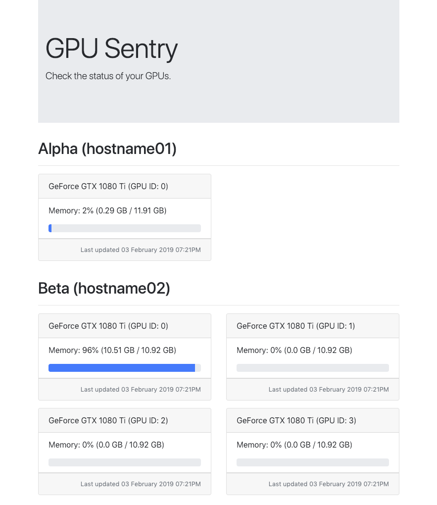

# gpu-sentry
Flask-based package for monitoring utilisation of nVidia GPUs.



## Motivation
Instead of checking each of your machines with `nvidia-smi` command, a client
running on the machines is sending periodically statistics about GPU memory
utilisation. The central server is collecting the requests and displays them on
a single website.

## Installation
Run `pip install -e .` to install all the dependencies and the package itself.

## Configuration
Most of the settings can be found in `config.py`.

`CLIENT_TIMEOUT` allows to set how often a client, i.e. the GPU machine sends
statistics to the central server. You can alter the value with the amount of
seconds you wish to set.

`PERMIT_CLIENTS` has two fold purpose, first the keys are used to filter out
machines which will be displayed on the website, i.e. we permit only machines
with the specified `hostname`s, and the corresponding values point to display
names.

## Running
Currently the package does not work as a background process so please use
`screen`, `tmux` or `wsgi`.

To run the package as client, i.e. on a GPU machine run

```
python cli.py -m client
```

or on the central server execute

```
python cli.py -m server
```
